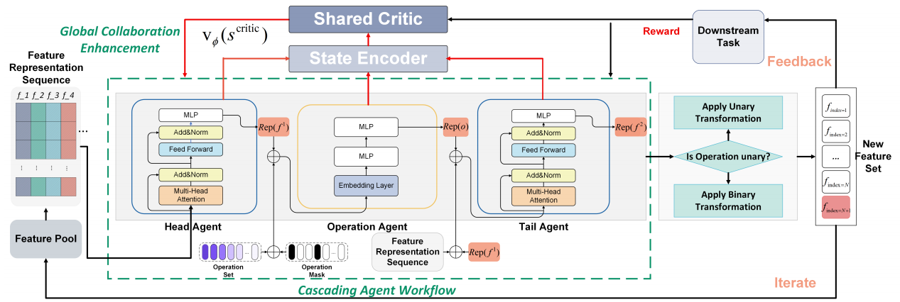

# HAFT

# Heterogeneous Multi-Agent Reinforcement Learning with Attention for Cooperative and Scalable Feature Transformation

--

## Paper Abstract

---

Feature transformation enhances downstream task performance
by generating informative features through mathematical feature
crossing. Despite the advancements in deep learning, feature transformation remains essential, particularly for structured data, where
deep models often struggle to capture complex feature interactions
effectively. Prior literature on automated feature transformation has
achieved notable success but often relies on heuristics or exhaustive searches, leading to inefficient and time-consuming processes.
Recent works employ reinforcement learning (RL) to enhance traditional approaches through a more effective trial-and-error way.
However, two key limitations remain: 1) Dynamic feature expansion during the transformation process, which introduces instability and increases the time complexity of the learning procedure
for RL agents; 2) Insufficient cooperation and communication between agents, which results in suboptimal feature crossing operations and degraded model performance. To address them, we
propose a novel heterogeneous multi-agent RL framework to enable
cooperative and scalable feature transformation. The framework
comprises three heterogeneous agents, grouped into two types,
each designed to select essential features and operations for feature crossing. To enhance communication among these agents, we
implement a shared critic mechanism that facilitates information
exchange during the feature transformation process. This collaboration enables the agents to learn more intelligent and effective
transformation policies. To handle the dynamically expanding feature space, we tailor multi-head attention-based feature agents to
select suitable features for feature crossing. This design facilitates
scalable decision-making and effective candidate selection based
on comprehensive global feature space information. Additionally,
we introduce a state encoding technique during the optimization
process to stabilize and enhance the learning dynamics of the RL
agents, resulting in more robust and reliable transformation policies.

---

Running examples:

python new2_main_final.py --dataset xx --id trail_id --num_episodes xx --max_steps xx --critic_lr xx --feature_lr xx --op_coef xx --ent_coef xx --n_splits xx --num_layer xx --top_k xx